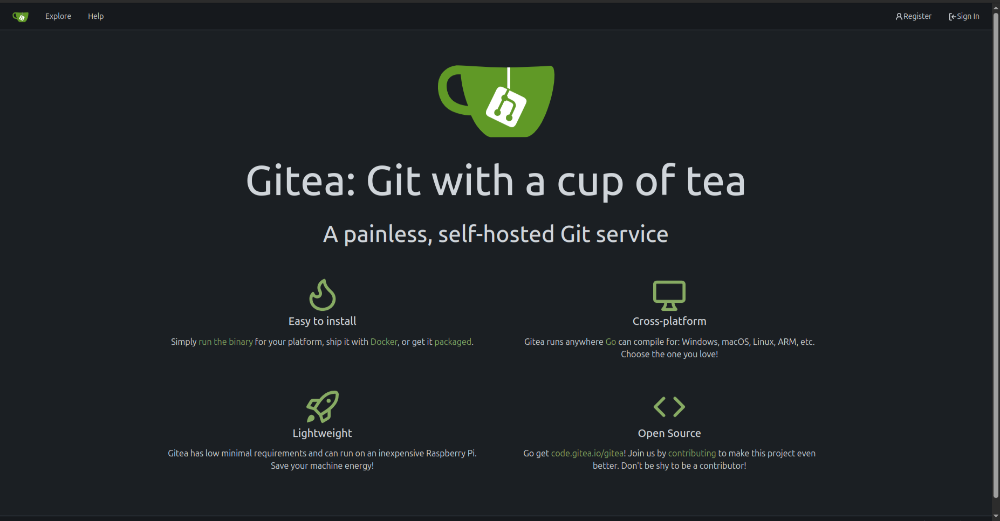
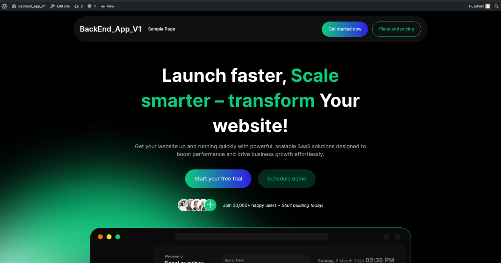
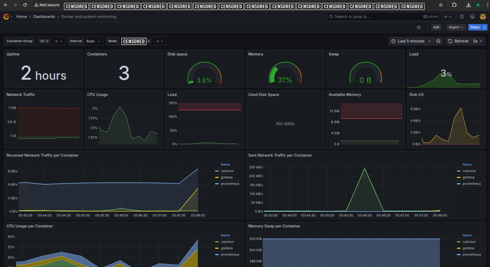
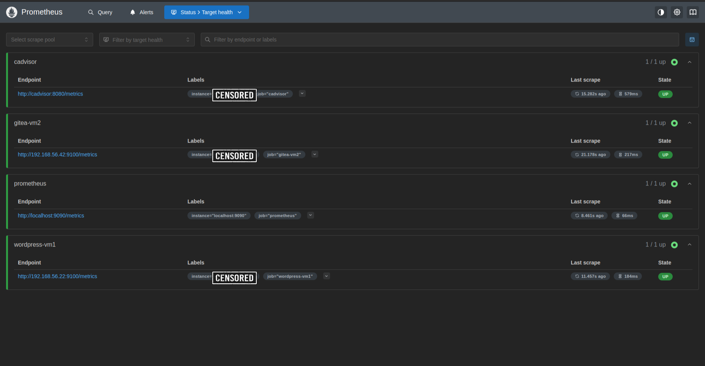
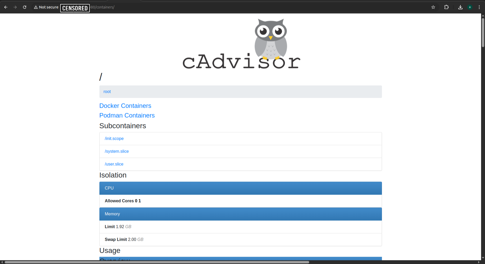

# 🛠️ Dockerized DevOps Lab: Gitea + WordPress on CentOS 8

[](https://www.docker.com/)
[](LICENSE)
[](https://www.centos.org/)
[](https://docs.docker.com/compose/compose-file/)

> **Self-host Git & WordPress** on your CentOS 8 VM using Docker — Quick deployment for DevOps & Web Devs.

---

## 📌 Overview

A lightweight, all-in-one Docker-based lab to run:
- ✍️ **Gitea** (self-hosted Git service like GitHub)
- 🌐 **WordPress** (PHP blog/CMS)
- 💾 **PostgreSQL & MySQL** as databases

Perfect for practicing full-stack deployment, testing CI/CD pipelines, or hosting your own dev tools.

---

## ✨ Features


### 🌐 WordPress Home


### 📊 Grafana Monitoring Dashboard  


### 📦 Prometheus Metrics Endpoint  


### 📈 cAdvisor Container Monitoring  


✅ Easy deployment using Docker Compose  
✅ Uses CentOS 8 as base host with systemd integration  
✅ Persistent volumes for DB and data durability  
✅ Secure ports via firewalld configuration  
✅ Optional systemd service to auto-start on reboot  

---

## ⚙️ Tech Stack

| Component    | Tool / Image                      |
|--------------|-----------------------------------|
| Git Hosting  | `gitea/gitea:latest`              |
| Blog CMS     | `wordpress:latest`                |
| Databases    | `postgres:alpine`, `mysql:5.7`    |
| Container    | Docker + Docker Compose           |
| OS Host      | CentOS 8                          |

---

## ⚡ Quick Start

### 1. 🧱 Update System & Install Docker

```bash
sudo dnf update -y && sudo dnf upgrade -y
sudo dnf install -y curl wget git firewalld

# Docker & Compose
sudo dnf config-manager --add-repo=https://download.docker.com/linux/centos/docker-ce.repo
sudo dnf install -y docker-ce docker-ce-cli containerd.io
sudo systemctl enable --now docker

# Docker Compose
sudo curl -L "https://github.com/docker/compose/releases/latest/download/docker-compose-$(uname -s)-$(uname -m)" \
-o /usr/local/bin/docker-compose
sudo chmod +x /usr/local/bin/docker-compose
```

### 2. 🛠 Create Project Folder

```bash
mkdir ~/docker-devlab && cd ~/docker-devlab
```

### 3. 🧾 Create `docker-compose.yml`

```yaml
version: '3'

services:
  gitea:
    image: gitea/gitea:latest
    environment:
      - DB_TYPE=postgres
      - DB_HOST=db:5432
      - DB_NAME=gitea
      - DB_USER=gitea
      - DB_PASSWD=gitea
    restart: always
    ports:
      - "3000:3000"
    volumes:
      - git_data:/data
    depends_on:
      - db

  db:
    image: postgres:alpine
    environment:
      - POSTGRES_USER=gitea
      - POSTGRES_PASSWORD=gitea
      - POSTGRES_DB=gitea
    restart: always
    volumes:
      - db_data:/var/lib/postgresql/data
    expose:
      - "5432"

  wordpress:
    image: wordpress:latest
    restart: always
    ports:
      - "8080:80"
    environment:
      - WORDPRESS_DB_HOST=wpdb:3306
      - WORDPRESS_DB_USER=wpuser
      - WORDPRESS_DB_PASSWORD=wppass
      - WORDPRESS_DB_NAME=wpdb
    depends_on:
      - wpdb

  wpdb:
    image: mysql:5.7
    restart: always
    environment:
      - MYSQL_DATABASE=wpdb
      - MYSQL_USER=wpuser
      - MYSQL_PASSWORD=wppass
      - MYSQL_ROOT_PASSWORD=rootpass
    volumes:
      - wp_db_data:/var/lib/mysql

volumes:
  db_data:
  git_data:
  wp_db_data:
```

### 4. 🔥 Configure Firewall

```bash
sudo systemctl enable --now firewalld
sudo firewall-cmd --permanent --add-port=3000/tcp
sudo firewall-cmd --permanent --add-port=8080/tcp
sudo firewall-cmd --reload
```

### 5. 🚀 Launch the Stack

```bash
docker-compose up -d
docker-compose ps
```

### 6. 🌐 Access Services

| Service   | URL                      |
|-----------|--------------------------|
| Gitea     | http://your-vm-ip:3000   |
| WordPress | http://your-vm-ip:8080   |

---

## 💡 Auto-Start with systemd

```bash
sudo tee /etc/systemd/system/devlab.service <<EOF
[Unit]
Description=DevLab Gitea & WordPress
Requires=docker.service
After=docker.service

[Service]
Type=oneshot
RemainAfterExit=yes
WorkingDirectory=/home/$(whoami)/docker-devlab
ExecStart=/usr/local/bin/docker-compose up -d
ExecStop=/usr/local/bin/docker-compose down
TimeoutStartSec=0

[Install]
WantedBy=multi-user.target
EOF

sudo systemctl enable --now devlab.service
```

---

## 🧰 Maintenance

```bash
docker-compose down          # Stop all
docker-compose up -d         # Start all
docker-compose logs          # View logs
docker-compose pull && docker-compose up -d  # Update
```

---

## 🖼 Screenshots

> Coming soon! Add your own screenshots here showing the Gitea UI and WordPress site.

---

## 🗂 Directory Layout

```bash
docker-devlab/
├── docker-compose.yml
├── screenshots/
│   ├── gitea-home.png
│   └── wordpress-home.png
└── README.md
```

---

## 🤝 Contributions

- Pull requests welcome  
- Create issues for bugs and improvements  
- Share with fellow DevOps & Fullstack enthusiasts!

---

## 📜 License

**MIT © 2025 Abdelkader** — DevOps & Cloud Infrastructure Projects

---

